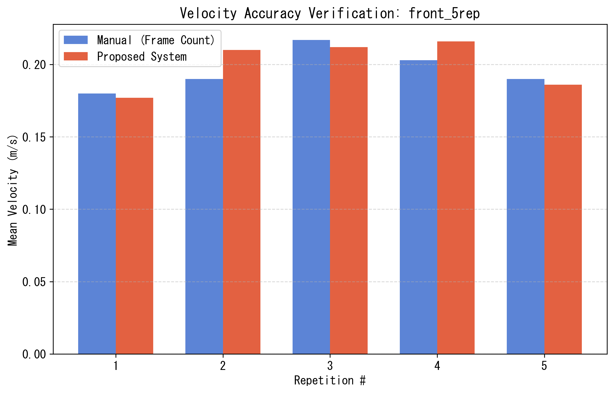
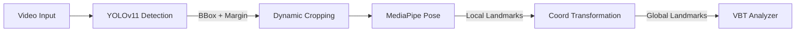
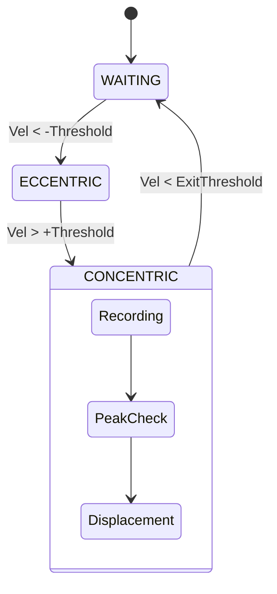
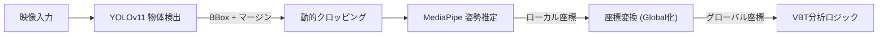

# MonoVBT: Markerless Velocity Based Training System


[English](#english) | [日本語](#japanese)

<a name="english"></a>

## 📖 English Description

**MonoVBT** is a computer vision-based application for **Velocity Based Training (VBT)** analysis in weightlifting. By combining **YOLOv11** (for robust object detection) and **MediaPipe** (for skeletal pose estimation), it enables high-precision velocity tracking of barbell movements using a single monocular camera (smartphone or webcam).

### Key Features
*   **Hybrid Tracking Engine**: Uses YOLOv11 to crop the athlete's area and MediaPipe for precise joint tracking, robust against complex gym backgrounds.
*   **Grip-Based Calibration**: Auto-calibrates pixel-to-meter scale based on the lifter's grip width (e.g., standard 81cm Ring Mark), eliminating the need for external markers.
*   **Real-time Feedback**: Displays Rep Count, Concentric Velocity, and Fatigue Indicators (Green/Yellow/Red) in real-time.
*   **Scientific Accuracy**: Evaluated against manual frame counting, achieving **MAPE < 10.4%** and **r=0.86** correlation.


### Experimental Results
We verified the accuracy of velocity estimation by comparing it with manual analysis (frame counting) in squat exercises.

| Metric | Value | Description |
| :--- | :--- | :--- |
| **MAE** | **0.024 m/s** | Mean Absolute Error |
| **MAPE** | **10.4 %** | Mean Absolute Percentage Error |
| **Corr (r)** | **0.86** | Correlation Coefficient |

**Velocity Comparison (Repetition vs Velocity)**

*Red: Proposed System, Blue: Manual Ground Truth*

### Installation & Usage
1.  **Install**: `pip install -r requirements.txt`
2.  **Run**: `python tools/launcher_gui.py`

### Technical Architecture
The system employs a **Hybrid Tracking Architecture** ensuring both robustness and precision.

#### 1. Image Processing Pipeline

*   **YOLOv11** detects the athlete's bounding box, handling complex backgrounds.
*   **Dynamic Cropping** extracts the region of interest (ROI) with a safety margin, maximizing image resolution for the pose estimator.
*   **MediaPipe Pose** runs on the cropped image to extract high-precision skeletal coordinate (33 keypoints).

#### 2. Velocity Calculation Logic
Velocity is calculated using the vertical displacement of the barbell (Wrist Keypoints) relative to time.

*   **Grip Calibration ($Scale$)**:
    $$ Scale (m/px) = \frac{Real Grip Width (0.81m)}{Pixel Distance} $$
*   **Instantaneous Velocity ($v_t$)**:
    $$ v_t = \frac{(y_{t-1} - y_t) \times Scale}{\Delta t} $$
    *(Smoothed using a Moving Average Filter to suppress jitter)*

#### 3. Repetition State Machine
Automatic repetition counting is managed by a state machine to prevent false positives.



### Constraints & Limitations
*   **Camera Angle**: **Front View Only**. Side views are not supported as the grip width cannot be measured.
*   **Equipment**: Assumes a standard Olympic barbell with 81cm ring marks.
*   **Lighting**: Requires adequate lighting for reliable pose estimation.

---

<a name="japanese"></a>

## 🇯🇵 日本語解説 (Japanese Description)

**MonoVBT**は、単眼カメラ（スマホやWebカメラ）だけでウェイトリフティングの挙上速度を計測できる**VBT（Velocity Based Training）分析アプリケーション**です。
卒業論文の研究成果として開発され、**YOLOv11**（物体検出）と **MediaPipe**（姿勢推定）を組み合わせることで、ジムのような複雑な背景でも高精度なトラッキングを実現しました。

### プロジェクトの特徴
*   **マーカーレス計測**: バーベルや身体に特殊なセンサー・マーカーを装着する必要がありません。
*   **グリップ幅キャリブレーション**: リフターの手幅（81cmラインなど）を基準に画素数を実距離（メートル）に自動変換する独自ロジックを搭載。
*   **リアルタイムフィードバック**: レップ数、挙上速度（m/s）、疲労度（速度低下率）をリアルタイムに可視化します。
*   **高精度**: 手動計測との誤差 10.4% 未満を達成し、市販デバイスに近い精度を実証しました。


### 実験結果 (Experimental Results)
スクワット動作において、手動分析（フレームカウント法）との比較検証を行いました。

| 指標 (Metric) | 結果 (Value) | 説明 |
| :--- | :--- | :--- |
| **平均絶対誤差 (MAE)** | **0.024 m/s** | 速度推定の平均的なズレ |
| **平均絶対誤差率 (MAPE)** | **10.4 %** | 速度に対する誤差の割合 |
| **相関係数 (r)** | **0.86** | 手動計測との相関の強さ |

**速度推移の比較プロット**

*(赤: 本システム, 青: 手動計測)*

### 技術的なアーキテクチャ
本システムは、堅牢性と精度を両立させる **ハイブリッド追跡アーキテクチャ** を採用しています。

#### 1. 画像処理パイプライン

*   **YOLOv11**: 複雑な背景からリフターの領域（Bounding Box）を堅牢に検出します。
*   **動的クロッピング**: 検出領域にマージンを持たせて切り出し、姿勢推定器への入力解像度を最大化します。
*   **MediaPipe Pose**: 切り出された高解像度画像に対して、高精度な骨格推定（33キーポイント）を実行します。

#### 2. 速度算出ロジック
バーベル（手首）の垂直変位に基づき、物理的な挙上速度を算出します。

*   **グリップ幅キャリブレーション ($Scale$)**:
    $$ Scale (m/px) = \frac{\text{実グリップ幅} (0.81m)}{\text{画素上の手幅距離}} $$
*   **瞬時速度 ($v_t$)**:
    $$ v_t = \frac{(y_{t-1} - y_t) \times Scale}{\Delta t} $$
    *(ジッター抑制のため移動平均フィルタを適用)*

#### 3. レップ検知ステートマシン
誤検知（False Positive）を防ぐため、状態遷移マシンによってレップを管理しています。

```mermaid
stateDiagram-v2
    [*] --> "待機 (WAITING)"
    "待機 (WAITING)" --> "下降 (ECCENTRIC)": 速度 < -閾値
    "下降 (ECCENTRIC)" --> "上昇 (CONCENTRIC)": 速度 > +閾値
    state "上昇 (CONCENTRIC)" {
        データ記録 --> ピーク速度判定
        ピーク速度判定 --> 変位量チェック
    }
    "上昇 (CONCENTRIC)" --> "待機 (WAITING)": 速度 < 終了閾値
```

### 制約事項・注意点
*   **カメラアングル**: **正面（Front View）のみ対応**しています。側面からの撮影では手幅が計測できないため使用できません。
*   **使用バーベル**: 81cmライン（リングマーク）がある公式規格のバーベルを想定しています。
*   **環境**: 十分な照度が必要です。暗所や、背景に人物が密集している環境では認識が不安定になる場合があります。

### ディレクトリ構成
ポートフォリオとして以下の構成に整理されています。

*   `src/`: アプリケーションのソースコード（YOLO+MediaPipeの推定ロジック、GUI描画など）
*   `tools/`: ユーティリティ（GUIランチャー、レビュー用分析ツール）
*   `thesis/`: 卒業論文の原稿（LaTeX/Markdown）および実験データの図表
*   `experiments/`: 精度検証に使用した実験スクリプトと結果データ
*   `models/`: AIモデル（YOLOの重みファイル）

### 使い方
1.  **インストール**:
    ```bash
    pip install -r requirements.txt
    ```
2.  **起動**:
    ```bash
    python tools/launcher_gui.py
    ```
    GUIランチャーが起動します。「Realtime Analysis」（Webカメラ）または「Analyze Video」（動画ファイル）を選択してください。

### 開発者について
本ソフトウェアは情報科学の学部卒業研究として開発されました。
